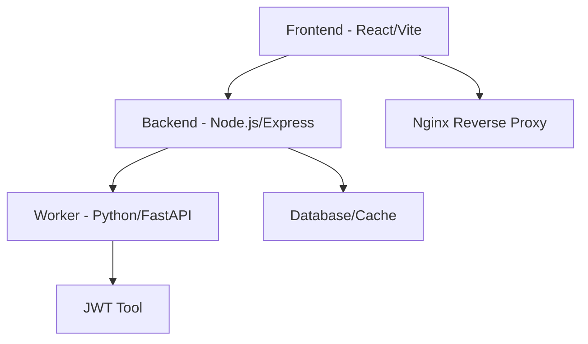

# 🔐 JWT Security Checker

> A comprehensive web-based platform for JSON Web Token security testing and analysis

**Built by [Al-Amir Badmus](https://github.com/Commando-X) for [Exploit-forge LTD](https://exploit-forge.com)**

[](https://opensource.org/licenses/MIT)
[](https://www.docker.com/)
[](https://github.com/features/actions)

JWT Security Checker is a professional-grade security testing platform designed for penetration testers, security researchers, and developers to analyze and test JSON Web Token implementations. Built with modern web technologies and powered by industry-standard tools.

## ✨ Features

### 🔍 **JWT Analysis & Manipulation**
- **Real-time JWT Decoder/Encoder** - Decode, edit, and encode JWTs with live preview
- **Signature Verification** - Verify token signatures with custom secrets
- **Algorithm Support** - Full support for HS256/384/512, RS256/384/512, ES256/384/512, and none
- **Claims Editor** - Interactive JSON and table view for easy claims modification

### ⚡ **Security Testing Tools**
- **JWT Secret Cracking** - Brute-force weak secrets using dictionary attacks
- **100,000+ Default Wordlist** - Comprehensive built-in wordlist for common secrets
- **Custom Wordlist Support** - Upload your own wordlists (up to 2MB)
- **Real-time Progress** - Live attack logs and progress monitoring
- **Algorithm Confusion Testing** - Test for algorithm switching vulnerabilities

### 🛠 **Pentesting Tool Collection**
- **JWTTool Integration** - Powered by the renowned jwt_tool by @ticarpi
- **Burp Suite Extensions** - JWT Editor, Hackvertor, JWT4B integration guides
- **Hashcat Support** - GPU-accelerated cracking capabilities
- **Multiple Cracking Tools** - Comprehensive toolkit for various attack vectors

### 🎨 **Modern User Interface**
- **JWT.io-inspired Design** - Familiar interface for security professionals
- **Dark/Light Theme** - Comfortable viewing in any environment
- **Responsive Design** - Works seamlessly on desktop, tablet, and mobile
- **Real-time Updates** - Live feedback during security testing operations

## 🚀 Quick Start

### Prerequisites
- Docker & Docker Compose
- Git

### Installation

1. **Clone the repository**
   ```bash
   git clone https://github.com/exploit-forge/xjwt.git
   cd xjwt
   ```

2. **Start with Docker Compose**
   ```bash
   docker-compose up -d
   ```

3. **Access the application**
   - Frontend: http://localhost:3000
   - Backend API: http://localhost:8000

That's it! The application will be running with all services configured.

## 🏗️ Architecture



### Services

| Service | Technology | Port | Purpose |
|---------|------------|------|---------|
| **Frontend** | React + Vite + Tailwind CSS | 3000 | User interface |
| **Backend** | Node.js + Express | 8000 | API endpoints |
| **Worker** | Python + FastAPI | - | JWT processing |
| **Nginx** | Reverse Proxy | 80/443 | Production routing |

## 📖 Usage Guide

### Basic JWT Operations

1. **Decode a JWT**
   - Paste your JWT token in the input field
   - View decoded header and payload in real-time
   - Switch between JSON and table view

2. **Verify Signature**
   - Enter the secret key used to sign the JWT
   - Select the appropriate algorithm
   - Click "Verify Signature" to check validity

3. **Generate New Token**
   - Edit header and payload as needed
   - Provide a secret key
   - Click "Generate Token" to create a new JWT

### Security Testing

1. **Crack JWT Secrets**
   - Navigate to "JWT Security Testing"
   - Paste the target JWT token
   - Optional: Upload custom wordlist
   - Click "Start Attack" and monitor progress

2. **Use Security Tools**
   - Visit the "Tools" section
   - Browse available penetration testing tools
   - Follow installation and usage guides

## 🛡️ Security Features

### Privacy Protection
- ✅ No permanent data storage
- ✅ Automatic cleanup of temporary files
- ✅ Server-side processing with immediate deletion
- ✅ No long-term retention of sensitive information

### Rate Limiting (Planned)
- Request frequency controls
- IP-based restrictions
- Resource usage monitoring
- DDoS protection

### Security Headers
- CORS protection
- Content Security Policy
- XSS protection
- Secure defaults

## 🧪 Development

### Local Development Setup

1. **Clone and install dependencies**
   ```bash
   git clone https://github.com/exploit-forge/xjwt.git
   cd xjwt
   
   # Frontend
   cd frontend
   npm install
   
   # Backend
   cd ../backend
   npm install
   ```

2. **Start development servers**
   ```bash
   # Terminal 1 - Backend
   cd backend
   npm run dev
   
   # Terminal 2 - Frontend
   cd frontend
   npm run dev
   ```

3. **Environment Configuration**
   ```bash
   # Frontend (.env)
   VITE_BACKEND_URL=http://localhost:8000/api
   
   # Backend (.env)
   PORT=8000
   NODE_ENV=development
   ```

### Testing

```bash
# Run all tests
npm run test

# Frontend tests
cd frontend && npm test

# Backend tests
cd backend && npm test

# Integration tests
npm run test:integration
```

### Building for Production

```bash
# Build all services
docker-compose build

# Or build individually
cd frontend && npm run build
cd backend && npm run build
```

## 📋 API Documentation

### Endpoints

| Method | Endpoint | Description |
|--------|----------|-------------|
| `POST` | `/api/decode` | Decode JWT token |
| `POST` | `/api/encode` | Create new JWT token |
| `POST` | `/api/verify` | Verify JWT signature |
| `POST` | `/api/crack` | Start JWT cracking attack |

### Example Requests

**Decode JWT**
```bash
curl -X POST http://localhost:8000/api/decode \
  -H "Content-Type: application/json" \
  -d '{"token": "eyJhbGciOiJIUzI1NiIsInR5cCI6IkpXVCJ9..."}'
```

**Verify Signature**
```bash
curl -X POST http://localhost:8000/api/verify \
  -H "Content-Type: application/json" \
  -d '{"token": "eyJhbGciOiJIUzI1NiIsInR5cCI6IkpXVCJ9...", "secret": "your-secret"}'
```
### Security Tools
- **JWT Tool** - Comprehensive JWT testing toolkit
- **Custom Wordlists** - Flexible dictionary support

## 🤝 Contributing

We welcome contributions! Please see our [Contributing Guide](CONTRIBUTING.md) for details.

### Development Workflow

1. Fork the repository
2. Create a feature branch (`git checkout -b feature/amazing-feature`)
3. Commit your changes (`git commit -m 'Add amazing feature'`)
4. Push to the branch (`git push origin feature/amazing-feature`)
5. Open a Pull Request

### Code Standards

- ESLint for JavaScript/TypeScript
- Prettier for code formatting
- Conventional Commits for commit messages
- Jest for testing

## 📄 License

This project is licensed under the MIT License - see the [LICENSE](LICENSE) file for details.

## 🙏 Acknowledgments

- **[jwt_tool](https://github.com/ticarpi/jwt_tool)** by @ticarpi - The powerful JWT testing toolkit that powers our cracking capabilities
- **[JWT.io](https://jwt.io)** - Inspiration for the user interface design
- **Security Community** - For continuous feedback and improvement suggestions

## 🔗 Links

- **🌐 Live Demo**: [https://xjwt.io](https://xjwt.io)
- **📚 Documentation**: [https://docs.exploit-forge.com](https://docs.exploit-forge.com)
- **🐛 Bug Reports**: [GitHub Issues](https://github.com/exploit-forge/xjwt/issues)
- **💬 Discussions**: [GitHub Discussions](https://github.com/exploit-forge/xjwt/discussions)

## 📞 Support

- **Website**: [https://exploit-forge.com](https://exploit-forge.com)
- **Email**: support@exploit-forge.com
- **Twitter**: [@exploitforge](https://twitter.com/exploitforge)
- **LinkedIn**: [Exploit-forge LTD](https://linkedin.com/company/exploit-forge)

---

<div align="center">
  <sub>Built with ❤️ by <a href="https://exploit-forge.com">Exploit-forge LTD</a></sub>
</div>
